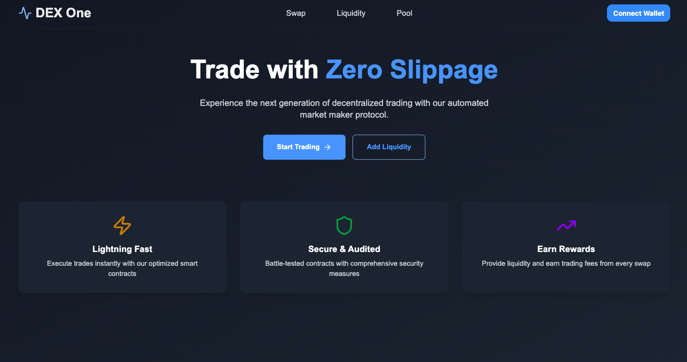
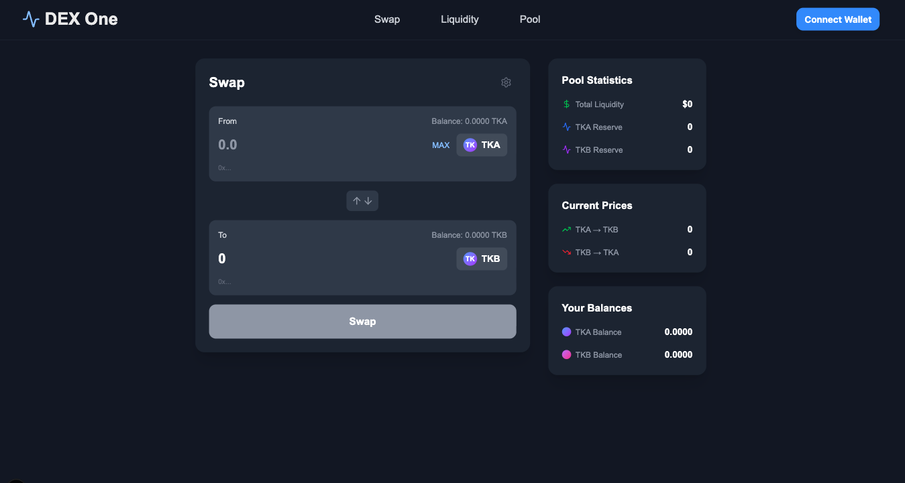
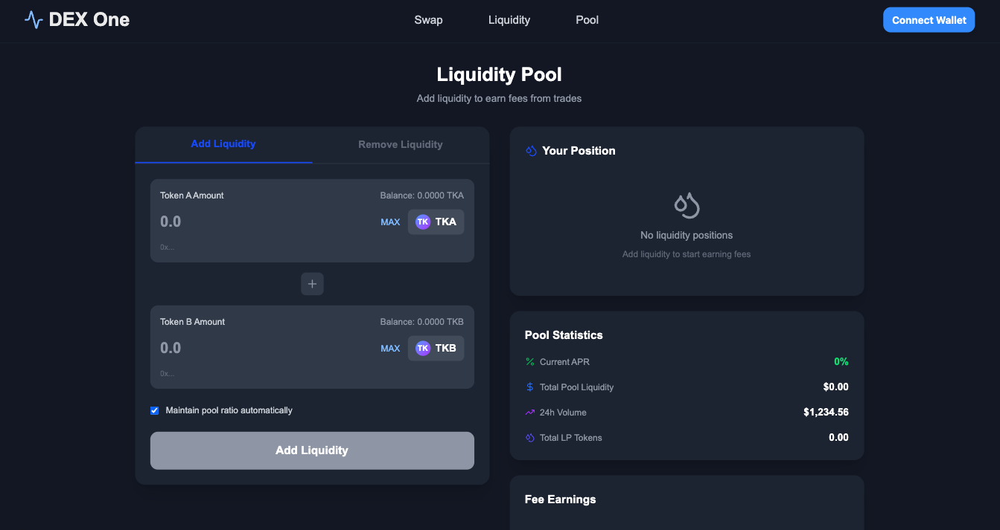
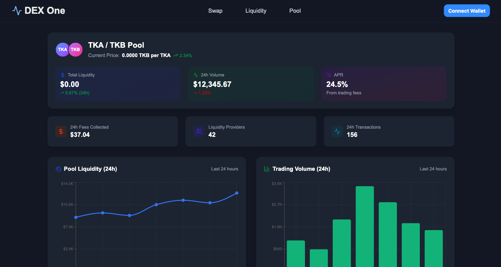

# DEX dApp

  
  
  
  

## Overview

This project is a **Decentralized Exchange (DEX)** built as a portfolio showcase to demonstrate knowledge of full-stack Web3 development.  
It implements a simplified **Automated Market Maker (AMM)** model, similar to Uniswap V2, where users can:

- Swap between two ERC-20 tokens
- Provide and withdraw liquidity
- Earn LP tokens representing their share in the pool
- See real-time pool statistics and token prices

The goal of this project is to highlight strong fundamentals in smart contract design, frontend dApp integration, and modern Web3 tooling. It was built with **performance, clean code, and scalability** in mind.

---

## Tech Stack

### Frontend
- **Next.js 15+**
- **React**
- **Wagmi** + **Viem**
- **RainbowKit** for wallet connection

### Smart Contracts / Backend
- **Solidity**
- **Hardhat**
- **TypeScript**
- **OpenZeppelin Contracts**

### Tooling
- **Bun** (runtime & package manager)

---

## Features

- 🔗 Wallet connection via RainbowKit (MetaMask, WalletConnect, etc.)
- 🔄 Token swaps with live output calculation
- 💧 Liquidity provision & LP token issuance
- 📊 Real-time pool reserves and price updates
- ✅ Approval handling before swaps
- 💸 Fee mechanism (0.3%) distributed to liquidity providers

---

## Project Structure

- `contracts/` → Solidity smart contracts + Hardhat setup  
- `frontend/` → Next.js application with custom hooks for contract interaction  
- `public/` → Images and static assets  
- `docs/` → Additional documentation  

---

## Getting Started

1. Clone the repository:
   ```bash
   git clone https://github.com/yourusername/dex-dapp.git
   cd dex-dapp```
